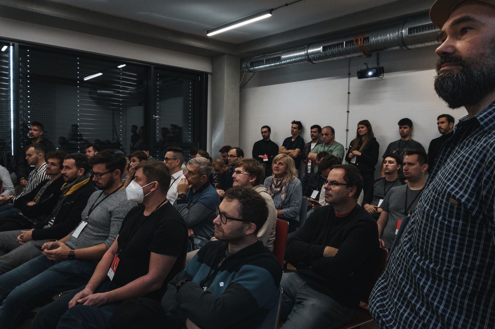

# What is ETHBrno?

ETHBrno is an annual independent & open community hackathon (former conference) for supporters of decentralised finance, smart contracts and Web3 happening in [Brno, Czech Republic](why-brno.md).

ETHBrno events are organized by [Gwei.cz](https://gwei.cz) community with the help of the [UTXO Foundation](https://utxo.foundation).

 .jpeg>)  

### Planned events

| Name                                                  | Date           | Topic              | Location           |
| ----------------------------------------------------- | -------------- | ------------------ | ------------------ |
| [ETHBrno² (2022)](events/2022/) :flag\_gb:            | 11.-13.11.2022 | Privacy & security | Impact Hub, Clubco |
| [ETHBrno Proxy 2022](events/proxy-2022.md) :flag\_cz: | 12.-13.11.2022 | Privacy & security | Impact Hub, Clubco |

### Past events

| Name                                    | Date      | Topic          | Location                              |
| --------------------------------------- | --------- | -------------- | ------------------------------------- |
| [ETHBrno 2021](events/2021/) :flag\_cz: | 9.10.2021 | _(conference)_ | [KC Skála](events/2021/misto-konani/) |

