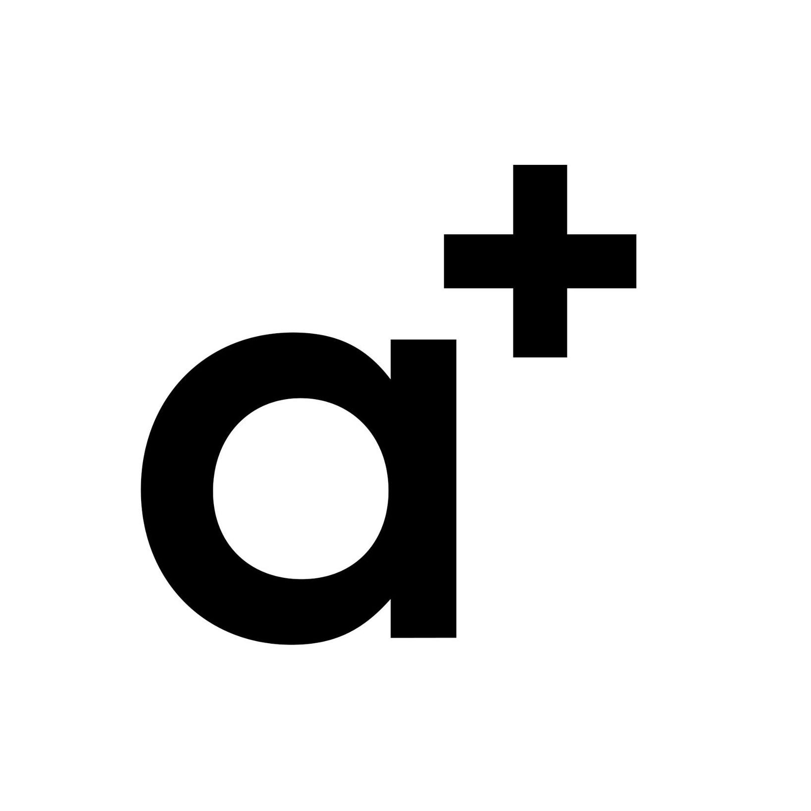

# Doprovodný program

## Pátek 8. října

### 19:00 \| Tour de ETHBrno

V rámci doprovodného programu pro ETHBrno 2021 si dáme sraz 8.10. v 19:00 v Brně, před pohodovým venkovním klubem FBB Na dráze, kde si dáme pivo/limo a mezi 20:00-20:30 se přesuneme na Jakubské náměstí, kde si Na Stojáka dáme, na co každý bude mít chuť, poklábosíme a přesuneme se do poslední lokace, kousek od Hlavního nádraží, podnik jménem Charlie's square.

 Nutno upozornit, že se program může měnit v závislosti na počtu účastníků a počasí. Budeme informovat v rámci následujicích dnů o případných změnách. Akce bude pravděpodobně probíhat po celou dobu venku.

Adresa a čas startovacího místa: Nádražní 9, 602 00 Brno, Czechia  -- FBB Klub Na Dráze, 19:00

## Sobota 9. října

Hlavní den ETHBrno, během kterého probíhá [hlavní program](../program/) v [Komunitním centru Skála](../misto-konani/).

### 21:30 - 🥴 \| [Afterparty - bar anoda ](afterparty-bar-anoda.md)

Naše afterparty se uskuteční v centru brna - v baru [**anoda**](https://www.facebook.com/anodabar/), kde společně popijeme za doprovodu místních DJs \(klidná elektronika\). Všichni návštěvníci jsou zváni!

Více informací, včetně adresy, FB události a jak se na místo dostat po akci z komunitního centra, najdete na pod stránce [Afterparty](afterparty-bar-anoda.md).

## Neděle 10. října

### 11:00 - 13:30 \| [Krypto-grilování v parku Lužánky](krypto-grilovani-v-parku-luzanky.md)

Po náročné sobotě přijde relax a společné grilování na čerstvém vzduchu uprostřed zeleně, v populárním brněnském parku Lužánky. Uvidíme jak vyjde počasí, ale teplým oblečením nic nezkazíte. Detaily TBA

### 14:00 - 18:00 \| [Gwei.cz Hackathon](gwei.cz-hackathon.md)

Nedělní odpoledne můžete strávit na [Gwei.cz](https://gwei.cz) hackathonu a pomoci s tvorbou lokálních edukačních materiálů a dalších našich projektů. Místo bude oznámeno.

## Pondělí 11. října

### 9:00 - 19:00 \| Inkubátor offline

Hackaton, kde se budeme věnovat našim společným projektům, viz níže. Místo konání a další informace budou oznámeny.

* Decentralizovaný CZK stablecoin \(dCZK\) - [Radek Švarz](../prednasejici.md#radek-svarz)
* P2P aplikace na směnu kryptoměn za fiat - [Petr Klein](../prednasejici.md#petr-klein)

