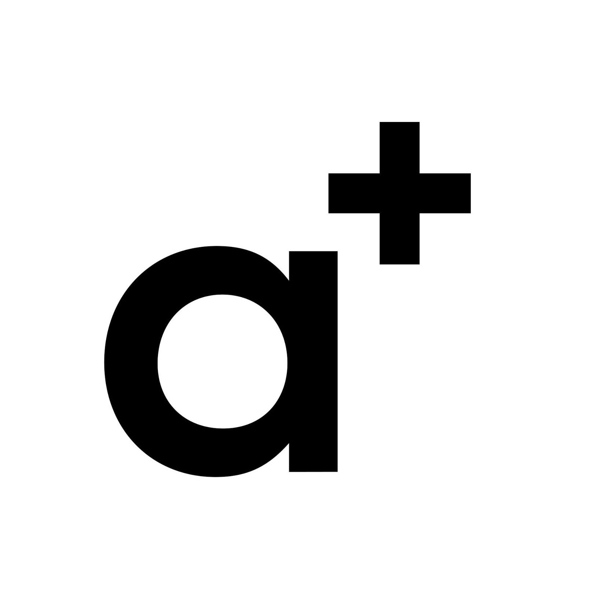

# Afterparty - bar anoda

Naše afterparty se uskuteční v centru brna - v baru [**anoda**](https://www.facebook.com/anodabar/), kde společně popijeme za doprovodu místních DJs \(klidná elektronika\). Všichni návštěvníci jsou zváni!

FB událost: [https://www.facebook.com/events/195240039345593](https://www.facebook.com/events/195240039345593)  
Adresa: **Kpt. Jaroše 39, 602 00 Brno-střed-Černá Pole** \([Google Maps](https://g.page/anodacafe?share)\)

## Doprava z komunitního centra na afterparty

Veřejnou dopravou je to **trolejbus č. 26**, který jede přímo od komunitního centra \(zastávka Oblá\) **do zastávky Pionýrská**, z které je to cca 8 min pěšky \(700m\) přes park Lužánky. Doba jízdy je 20 minut \(15 zastávek\) a i s chůzí je to 31 min. \([Google Maps navigace](https://www.google.com/maps/dir/Komunitn%C3%AD+a+spole%C4%8Densk%C3%A9+centrum+Sk%C3%A1la,+Obl%C3%A1+505%2F54a,+634+00+Brno-Nov%C3%BD+L%C3%ADskovec/anoda,+t%C5%99%C3%ADda+Kapit%C3%A1na+Jaro%C5%A1e,+Brno-st%C5%99ed-%C4%8Cern%C3%A1+Pole/@49.1879903,16.5445624,13z/am=t/data=!4m18!4m17!1m5!1m1!1s0x4712957f6ee6e7a5:0xbb3cefd926ca5a99!2m2!1d16.5513999!2d49.1771533!1m5!1m1!1s0x471295527fda8e29:0x2036e73b3e03306d!2m2!1d16.6103369!2d49.2037702!2m3!6e0!7e2!8j1633813860!3e3)\).

Odjezdy trolejbusu č.26 na afterparty \([zdroj](http://www.jrbrno.cz/L26S2Z382#zjr04)\):

* 20:10, 20:30, 20:51, 21:21, 21:51, 22:21

