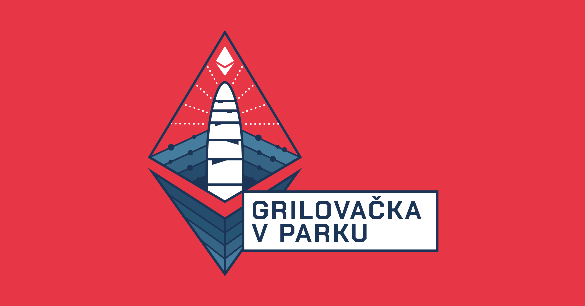

# Krypto-grilování v parku Lužánky

Po náročné sobotě přijde relax a společné grilování na čerstvém vzduchu uprostřed zeleně, v populárním brněnském parku Lužánky. Uvidíme jak vyjde počasí, ale teplým oblečením nic nezkazíte.

Na akci si budete moci koupit nějaké krypto za cash a rovnou si pomocí něj koupit například grilovanou klobásu, hermelín nebo zbytky merche po sobotní konferenci. Můžete si tak vyzkoušet práci s různými ethereum L2 či sidechain řešeními, které jsou právě vhodné na posílání drobných transakcí.

Můžete se ale pouze jenom stavit a popovídat si s námi o kryptoměnách :)

FB Událost: [https://www.facebook.com/events/582043239803207](https://www.facebook.com/events/582043239803207)

### Místo konání

**Adresa:** Pionýrská 247/11, 602 00 Brno-Královo Pole-Ponava

**Google Maps:** [Zde](https://www.google.com/maps/place/Public+grill+Lu%C5%BE%C3%A1nky/@49.2079009,16.6064606,18z/data=!4m5!3m4!1s0x47129468377e7dd9:0xa46f3f8a3cddb2e3!8m2!3d49.2079482!4d16.6067093?hl=en-US)

 (1).png>)
