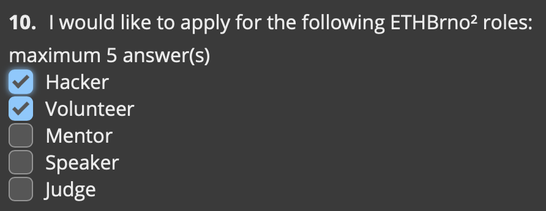
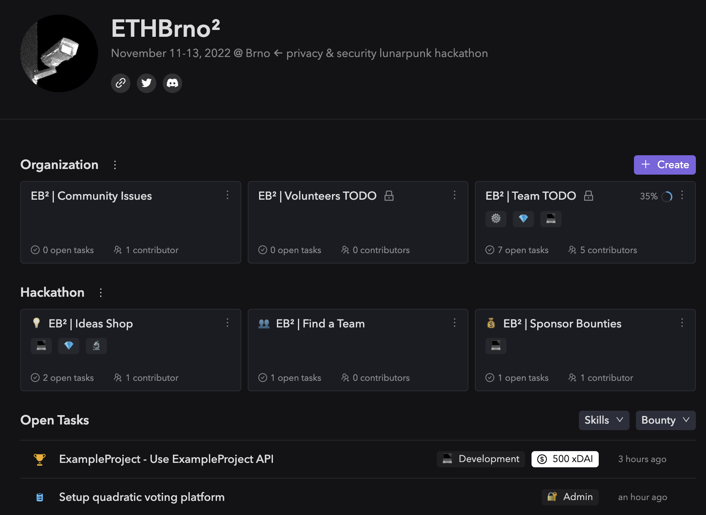
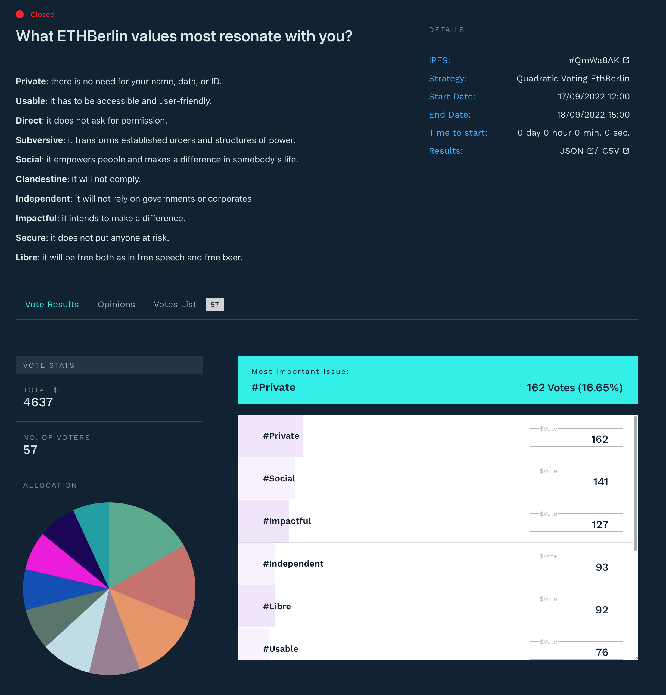

# Hackathon


Register here  👉  [join.ethbrno.cz](https://join.ethbrno.cz/)


Becoming an _active participant_ is the only way you can get a ticket and secure your participation in ETHBrno². We're expecting a few hundred hackers (or volunteers, speakers, mentors, judges) and we won't be selling any tickets.

You don't have to be a smart-contract developer or programmer to participate in our hackathon - you can be also a copywriter, economist, graphic designer, community builder, translator... Today's world of cryptocurrencies and Web3 is no longer just a nerd tech thing, but we need collaboration across professions to move forward.&#x20;

Our hackathon is open to all open minds who don't want to stand passively by, but want to put their own hands and heads to work in our _collective effort_. But, that doesn't mean you have to sit at your laptop and work all the time. The main thing is to enjoy the event - meet new interesting people or learn something new that will broaden your horizons.

This year's theme is **privacy and security** (read [our Manifesto](./#manifesto)).

## What to expect

We will do our best to make your experience as pleasant as possible:

* 🌱 Pleasant and friendly environment full of enthusiastic people
* :speech\_balloon: Dozens of experienced mentors who will be happy to help you with your project
* 📚 Lots of [talks and workshops](talks-and-workshops.md) where you can learn about current trends
* :salad: Food and drinks for all participants (for free of course!)
* ⛺ Meeting rooms, for team private meetings etc. (reservation required)
* 🔌 Ultra fast internet connection and power sockets everywhere
* 👕 Swag bag with ETHBrno t-shirt and sponsors' items for each participant
* 🍸 Various interesting side-events and parties
* ❓ You can only love or hate Brno, together we will find out why
* ✨ And much more...

## Hackathon features

### Unified application form

Some participants want to have multiple roles at the same time and filling out multiple forms is a hassle. So we thought why not have one single form!&#x20;

All [participants roles](hackathon.md#the-participants-roles) (hacker, volunteer, mentor, speaker, judge) can now apply for the hackathon using a single application form - [join.ethbrno.cz](https://join.ethbrno.cz)

<figure><figcaption>
Snippet from our application form
</figcaption></figure>

### Using Dework.xyz

[Dework](https://dework.ethbrno.cz/) is web3-native project management. We use it for the following:

* Organization:
  * [Community Issues](https://app.dework.xyz/ethbrno/community-space) - Community tasks
  * [Community Suggestions](https://app.dework.xyz/ethbrno/suggestions) - Your ideas to improve our hackathon
  * Task management for core & production team and volunteers
* Hackathon:
  * [Ideas Shop](https://app.dework.xyz/ethbrno/ideas-shop/view/board-l8awhuan) - Ideas for projects that you can improve or implement as part of the hackathon
  * [Find a team](https://app.dework.xyz/ethbrno/eb-or-find-a-team-44886) - A ticket system to help find hackers for a team, or find a team for hackers
  * [Sponsor bounties](https://app.dework.xyz/ethbrno/eb-or-sponsor-bounti/view/board-l8c0oe13) - Extra rewards from sponsors for completing special tasks

<figure><figcaption>
Our <a href="https://app.dework.xyz/ethbrno">Dework overview</a>
</figcaption></figure>

### Quadratic funding/voting

Similar to ETHBerlin³, we will use quadratic voting for the main prize pool. We will build on this idea and try to make more use of quadratic voting.

For expert tracks we are thinking about using a quadratic funding system, where each project would be rewarded according to the votes of the judges.

<figure><figcaption>
<a href="https://vote.ethberlin.ooo/2022/proposal/QmWa8AKj58Tb7Dy59WJAZbidh6g51sVbmmSSMAsKK9Ek8E">What ETHBerlin values most resonate with you?</a> @ ETHBerlin³
</figcaption></figure>

## The participants' roles

Each participant has an active role in the hackathon, this year we have 5 roles:

* **Hacker**
* **Volunteer**
* **Mentor**
* **Speaker**
* **Judge**

You can apply for any role (and even more roles at the same time) in the application form, but you must justify your choice to us.

## Apply for the hackathon

1. Complete and submit the Universal application form: [join.ethbrno.cz](https://join.ethbrno.cz)
2. The organisers will consider your application - if you are accepted then you will receive a email confirmation with your free hacker ticket

## Examples of hacks

Here are some examples of what you can start building:

* A privacy- or security-enhancing tool of any kind
* Blockchain or smart-contract analysis tool
* Marketing campaign to promote privacy and security
* Practical demonstration of the use of Zero-knowledge proofs
* Identification of risks associated with Layer2s
* Analysis of risks and threats in relation to the supply chain (wallets, node providers etc.)
* Contribute to public good open-source projects

More specific examples can be found on our Dework in [Ideas Shop](https://app.dework.xyz/ethbrno/ideas-shop) section.

## Rules

* Maximum of 5 people per team
* Projects must be related to the "Privacy & Security" topic
* All code for projects must be written during the event
* You cannot steal another team’s source code
* The decision of judges is final in terms of determining prizes and awards
* Teams may have members joining remotely
* Teams that have members joining remotely must have a member present on the venue for the judging

