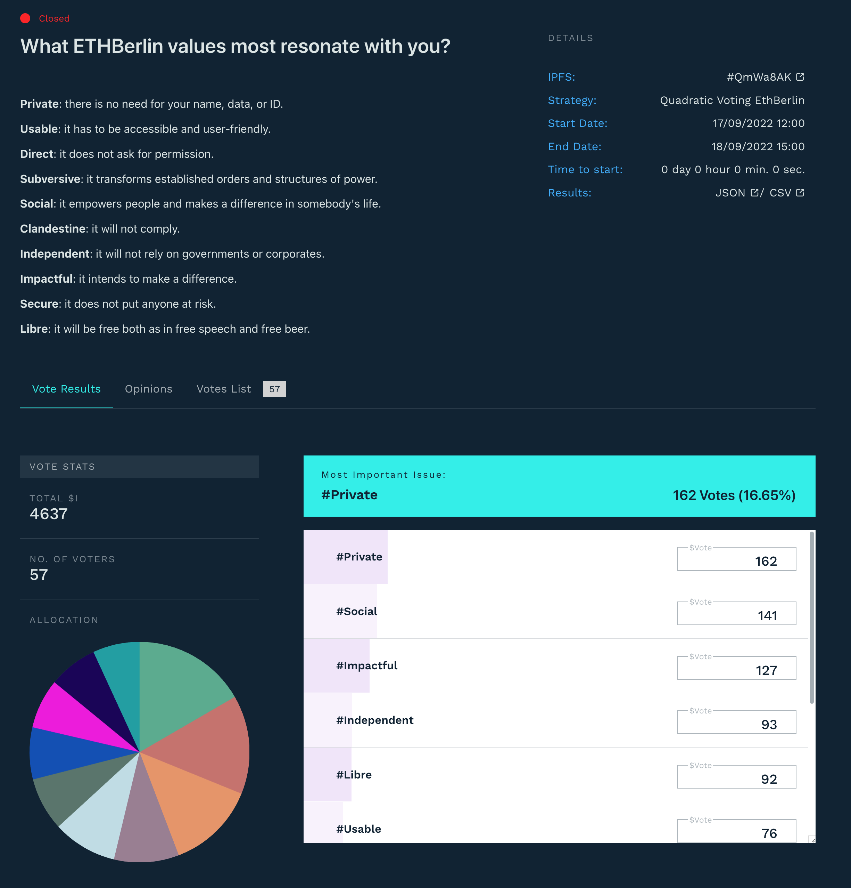

# Hackathon features

## Unified application form (UAF)

Some participants want to have multiple roles at the same time and filling out multiple forms is a hassle. So we thought why not have one single form!&#x20;

All [participants roles](hackathon-features.md#the-participants-roles) (hacker, volunteer, mentor, speaker, judge) can now apply for the hackathon using a single application form - [join.ethbrno.cz](https://join.ethbrno.cz)

<figure><figcaption>
Snippet from our application form
</figcaption></figure>

## Quadratic funding/voting

Similar to [ETHBerlin³,](https://vote.ethberlin.ooo/) we will use quadratic voting for the main prize pool. We will build on this idea and try to make more use of quadratic voting.

For expert tracks we are thinking about using a quadratic funding system, where each project would be rewarded according to the votes of the judges.

<figure><figcaption>
<a href="https://vote.ethberlin.ooo/2022/proposal/QmWa8AKj58Tb7Dy59WJAZbidh6g51sVbmmSSMAsKK9Ek8E">What ETHBerlin values most resonate with you?</a> @ ETHBerlin³
</figcaption></figure>

## Matrix as the main communication tool

Instead of the classic and centralized Discord, we chose the open platform [Matrix](https://matrix.org/) as the main communication tool.

Join the discussion: [#ethbrno:gwei.cz](https://matrix.to/#/#ethbrno:gwei.cz)


Learn more about the Matrix at [joinmatrix.org](https://joinmatrix.org/).


## Using self-hosting / FOSS

For the hackathon needs we try to use as much FOSS (Free and open-source software) as possible on our own infrastructure (self-hosted):

* ****[CryptPad](https://cryptpad.fr/) - forms (especially application forms for participants) and other documents
* [Jitsi](https://jitsi.org/) - video conferencing software ([meet.gwei.cz](https://meet.gwei.cz/))
* ****[Pretix](https://pretix.eu/about/en/) - ticketing software w/ check-in via QR code ([pretix.utxo.cz](https://pretix.utxo.cz/))
* [BTCPay Server](https://btcpayserver.org/) - cryptocurrency payment processor ([btcpay.utxo.cz](https://btcpay.utxo.cz/))
