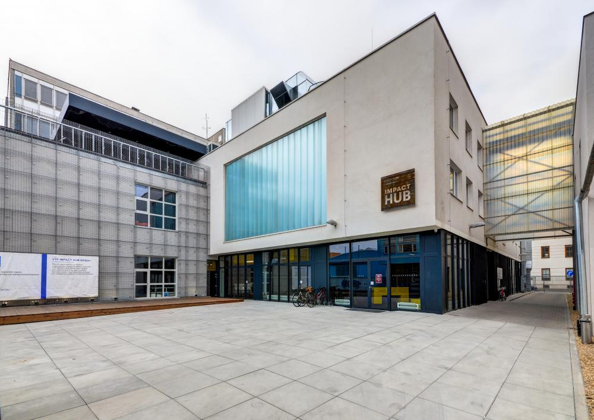
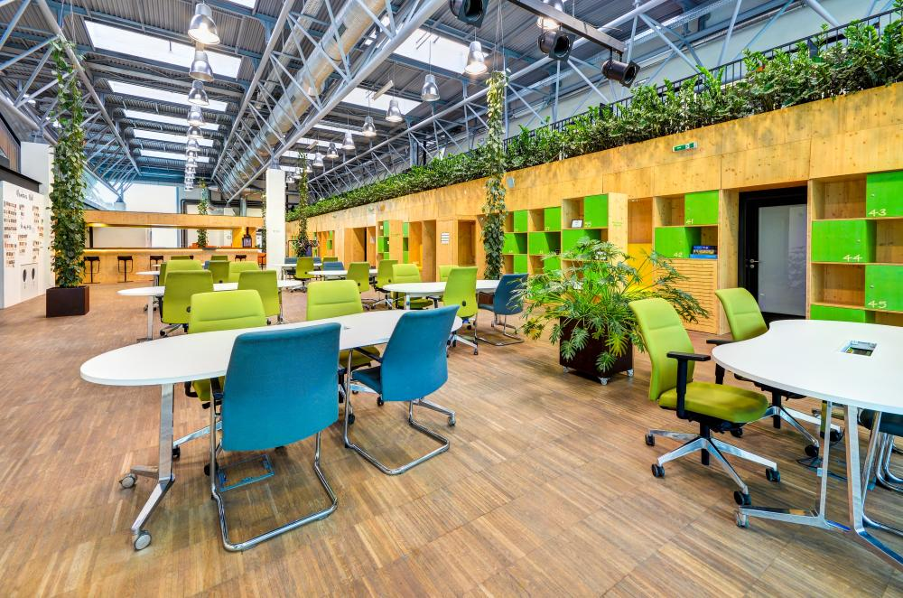
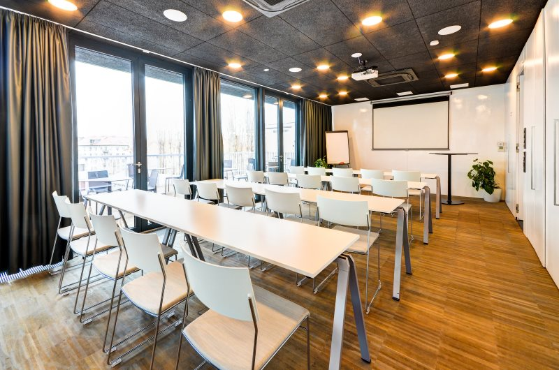
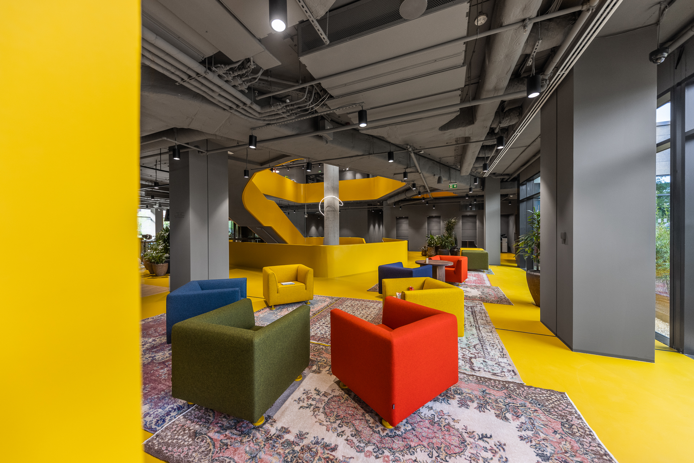
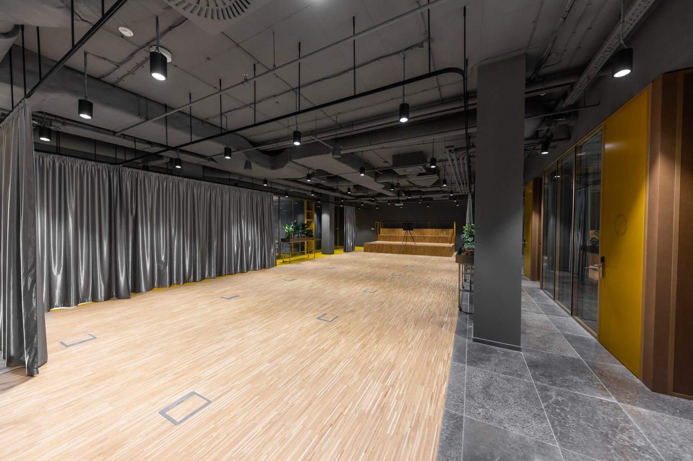
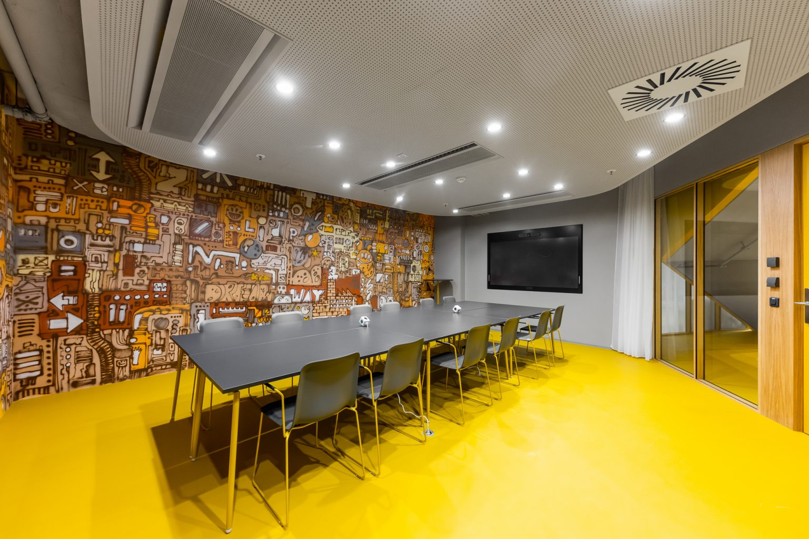

# Venues


We are working on arranging additional venues to expand our capacity a bit.


## Impact Hub Brno

* Adress: **Cyrilská 7, Brno, 602 00** ([Google Maps](https://goo.gl/maps/wutjvk8jCFuDcvSG6), [OSM](https://www.openstreetmap.org/way/339769163)) - web: [hubbrno.cz](https://www.hubbrno.cz/en/)
* Opening hours: **Fri Nov 11 13:00 - Sun Nov 13 20:00 (nonstop!)**

The main venue will be a modern coworking space called _Impact Hub_, just a few minutes walk from the city centre and the main train station. In less than 7 years of its existence, it has become an important part of Brno's freelancing community, inspiring and connecting many people. Great place for our hackathon, don't you think?

_Impact Hub_ will serve as the **main basecamp for the hackathon** and will be **available for hackers all day 24/7**.

You'll have everything you might need - different work areas (single or team, sitting or standing), fast internet, power sockets everywhere, meeting rooms, refreshments and much more. We want you to feel as comfortable as possible and we will do everything we can to make that happen.

  

## Clubco

* Adress: **Vlněna 5, Brno, 602 00** ([Google Maps](https://g.page/clubco-brno?share), [OSM](https://www.openstreetmap.org/node/8848071783)) - web: [clubco.cz](https://clubco.cz/)
* Opening hours: **Fri Nov 11: 14:30 - 22:00, Sat Nov 10: 9:00 - 22:00, Sun Nov 13: 9:00 - 17:00**

Additional venue, only 3-5 minutes walk from Impact Hub). It will be an additional space for hackers that offers another style of private meeting rooms and open workspaces. It also includes an event space where additional workshops and lectures will be held.

This location will **NOT be open 24/7**, you will need to move to the Impact Hub for the night.

<figure><figcaption></figcaption></figure>

 

<figure><figcaption></figcaption></figure>

 

<figure><figcaption></figcaption></figure>

