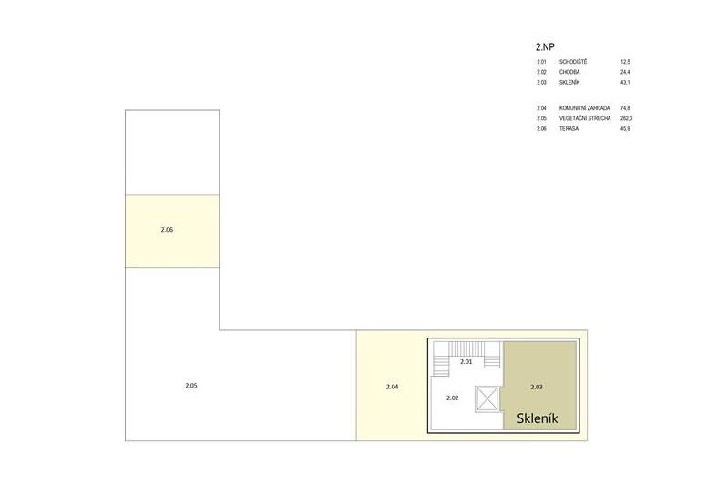

# Místo konání

## Komunitní centrum Skála

Akce se bude konat v komunitním centru v Brně, v městské části Nový Lískovec. Toto centrum bude celé k dispozici jen pro ETHBrno 2021.

Adresa: **Oblá 505/54a, 634 00 Brno - Nový Lískovec** _****_\([Google Maps](https://goo.gl/maps/wbZFMrzfBHDTtRRK8)\)  
Webové stránky: [Komunitním centru Skála](https://novy-liskovec.cz/komunitni-centrum-skala/ds-1389)

♿Celý areál komunitního centra je bezbariérově přístupný.

Jak se na místo dostat, naleznete v sekci [Doprava](../prakticke-informace/doprava.md).

## Dostupné prostory

### Sály na přednášky a workshopy

1. **Velký sál** \(kapacita 100 lidí\) - přednášky, panelové diskuze
2. **Malý sál** \(kapacita 25 lidí\) - přednášky
3. **Zkušebna** \(kapacita 25 lidí\) - workshopy
4. **Klubovna** \(kapacita 15 lidí\) - workshopy \(separátní prostor\)

### Společné prostory

* **Kavárna** - networking, občerstvení
* **Dřevěná venkovní terasa** - posezení, kuřácký koutek
* **Skleník -** chillout

## Plán objektu















## Internet \(WiFi\)

V celém objektu bude k dispozici WiFi připojení k internetu. Detaily jak a kam se připojit se dozvíte přímo na místě.

