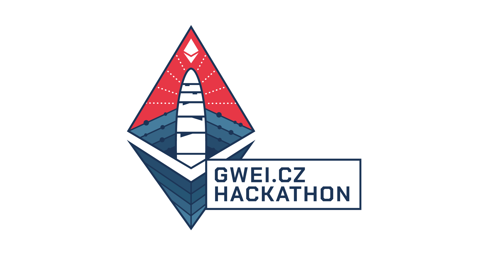

Místo: TBA\
Organizuje: [**@tree**](https://twitter.com/gweicz)

Setkání, pro které zarezervujeme nějakou konferenční místnost či něco podobného, kde se pokusíme nějak společně posunout komunitní věci kupředu.

Hackathon je otevřený pro kohokoliv koho zajímá budoucnost [Gwei.cz](http://gwei.cz/) komunity, nebo toho co děláme. Budeme rádi když dorazíte a přiložíte ruku k dílu!

Za [Gwei.cz Council](https://komunita.gwei.cz/council) se účastní:

* @tree
* @vojtch

## Program hackathonu

* Úvodní Governance Call živě
* Zrekapitulujeme naše současné projekty a jejich stav
* Projdeme si úkoly v Trello, případně rozdělíme další úkoly
* Zbytek času se pokusíme udělat nějakou práci

