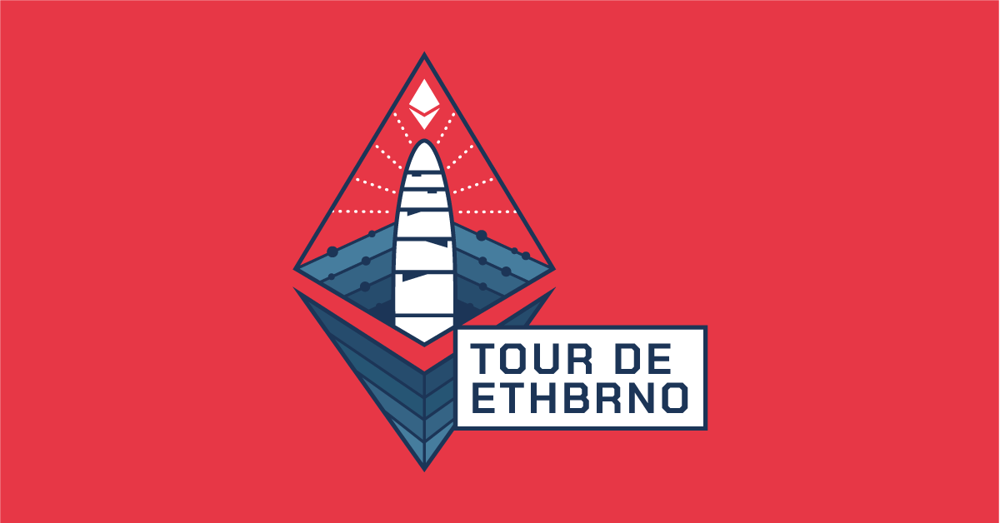

V rámci doprovodného programu pro ETHBrno 2021 si dáme sraz 8.10. v 19:00 v Brně, před pohodovým venkovním klubem FBB Na dráze, kde si dáme pivo/limo a mezi 20:00-20:30 se přesuneme na Jakubské náměstí, kde si Na Stojáka dáme, na co každý bude mít chuť, poklábosíme a přesuneme se do poslední lokace, kousek od Hlavního nádraží, podnik jménem Charlie's square.

&#x20;Nutno upozornit, že se program může měnit v závislosti na počtu účastníků a počasí. Budeme informovat v rámci následujicích dnů o případných změnách. Akce bude pravděpodobně probíhat po celou dobu venku.

Adresa a čas startovacího místa: Nádražní 9, 602 00 Brno, Czechia  -- FBB Klub Na Dráze ([Google Maps](https://goo.gl/maps/qbRcxpmmtczSjdkS8)), 19:00

FB Událost: [https://www.facebook.com/events/1050641142339488](https://www.facebook.com/events/1050641142339488)
