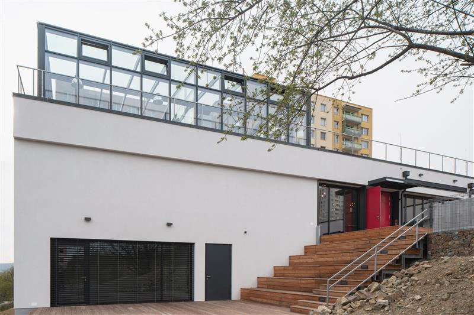
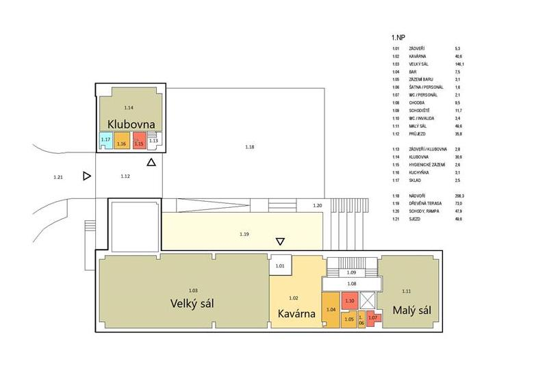
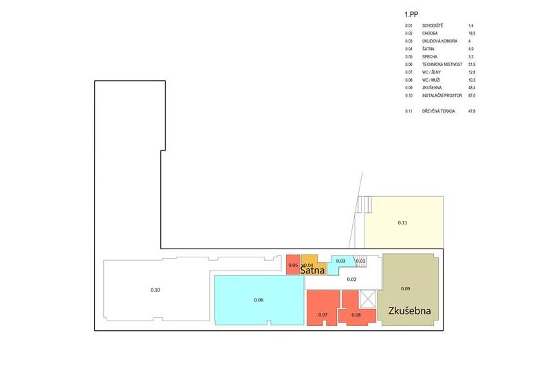
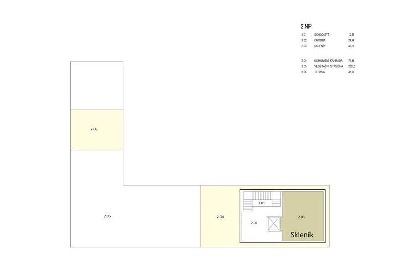

## Komunitní centrum Skála

Akce se bude konat v komunitním centru v Brně, v městské části Nový Lískovec. Toto centrum bude celé k dispozici jen pro ETHBrno 2021.

Adresa: **Oblá 505/54a, 634 00 Brno - Nový Lískovec** ([Google Maps](https://goo.gl/maps/wbZFMrzfBHDTtRRK8))\
Webové stránky: [Komunitním centru Skála](https://novy-liskovec.cz/komunitni-centrum-skala/ds-1389)

:wheelchair:Celý areál komunitního centra je bezbariérově přístupný.

Jak se na místo dostat, naleznete v sekci [Doprava](../prakticke-informace/doprava.md).

## Dostupné prostory

### Sály na přednášky a workshopy

1. **Velký sál** (kapacita 100 lidí) - přednášky, panelové diskuze
2. **Malý sál** (kapacita 25 lidí) - přednášky
3. **Zkušebna** (kapacita 25 lidí) - workshopy
4. **Klubovna** (kapacita 15 lidí) - workshopy (separátní prostor)

### Společné prostory

* [**Kavárna Coffee Trail Garden**](kavarna-coffee-trail-garden.md) - networking, občerstvení
* **Dřevěná venkovní terasa** - posezení, kuřácký koutek
* **Skleník -** chillout

Můžete si prohlédnout [Fotky](kam-se-muzete-tesit.md).

## Plán objektu

### 1. nadzemní podlaží

# 1. podzemní podlaží

# 2. nadzemní podlaží

## Internet (WiFi)

V celém objektu bude k dispozici WiFi připojení k internetu. Detaily jak a kam se připojit se dozvíte přímo na místě.