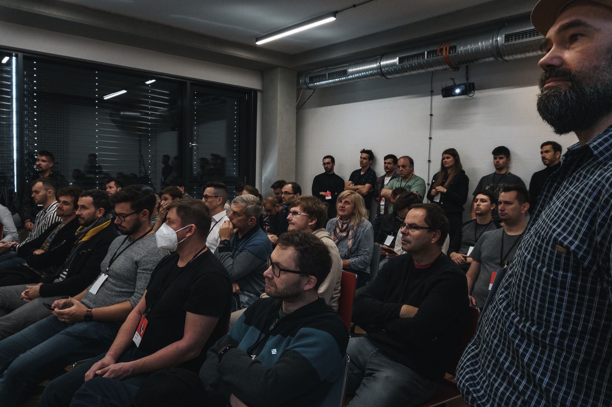
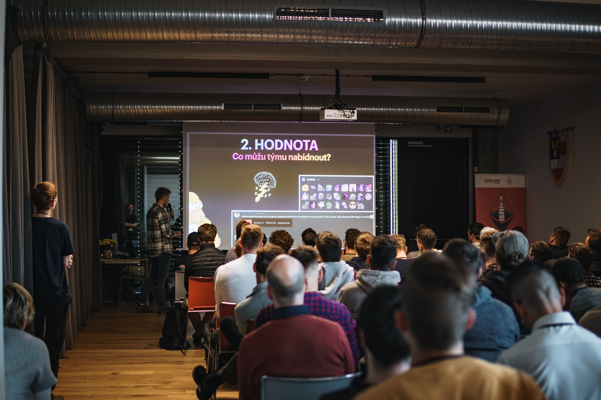
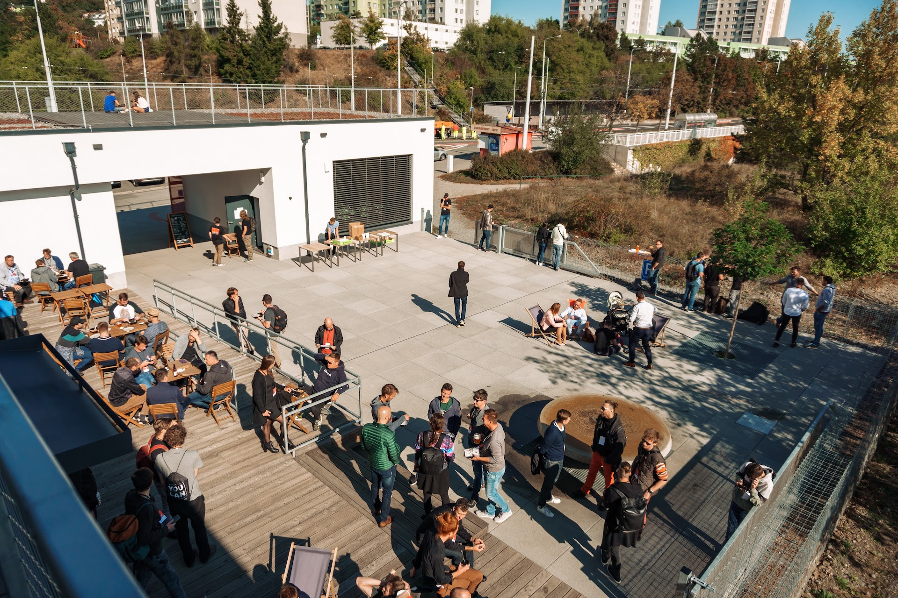

```
    ______________  ______                 
   / ____/_  __/ / / / __ )_________  ____ 
  / __/   / / / /_/ / __  / ___/ __ \/ __ \
 / /___  / / / __  / /_/ / /  / / / / /_/ /
/_____/ /_/ /_/ /_/_____/_/  /_/ /_/\____/ 
                                           
```

ETHBrno is an annual independent & open community hackathon for supporters of decentralised finance, smart contracts, and also privacy and security in [Brno, Czech Republic](why-brno.md).

ETHBrno events are organized by [Gwei.cz](https://gwei.cz) and [Web3Privacy Now](https://web3privacy.info/) community.

## Planned events

| Name | Date | Topic | Location |
| --- | --- | --- | --- |
| [ETHBrno×3 (2024)](/events/2024) | October 2024 | Privacy & security hackathon 🇬🇧 | TBD |

## Past events

| Name | Date | Topic | Location |
| --- | --- | --- | --- |
| ETHBrno Proxy 2022 | 13.11.2022 | Privacy & security sub-conference 🇨🇿 | Clubco, Brno |
| [ETHBrno² (2022)](/events/2022) | 11.-13.11.2022 | Privacy & security hackathon 🇬🇧 | Impact Hub, Brno |
| [ETHBrno 2021](/events/2021) | 9.10.2021 | Ethereum conference 🇨🇿 | KC Skála, Brno |

## Photos from ETHBrno 2021






